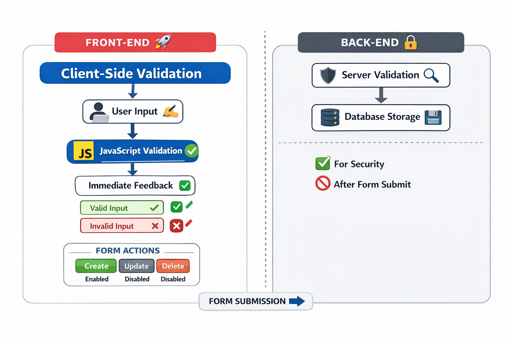
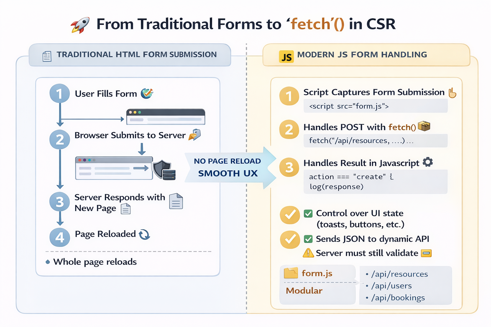

> [!NOTE]
> The material was created with the help of ChatGPT and Copilot.

# ✅ Client-Side Validation with CSR + JavaScript

Below is a **material** based directly on the two attached files: [[`resources.html`](Phase2/app/resources.html)] and [[`resources.js`](Phase2/app/resources.js)]. The focus is **CSR (Client-Side Rendering) + JavaScript validation** explained step by step. All code references are grounded in the provided files.

**You can also find the pages and codes at these links:**
* https://vheikkiniemi.github.io/BasicsOfWeb2025SPages/BS/Phase1/app
* https://vheikkiniemi.github.io/BasicsOfWeb2025SPages/BS/Phase2/app

## 🌍 Background: What, Why, and When?

**🔹 What is CSR validation?**

Client-Side Rendering (CSR) validation means that **input validation is handled in the browser using JavaScript**, *before* the form is submitted to the server.

In this material:

* HTML provides **structure**
* JavaScript provides **logic**
* CSS (Tailwind) provides **visual feedback**
* No backend validation is enforced yet

👉 This is a **pure frontend responsibility**.

---

**🔹 Why do we validate on the client side?**

Client-side validation is primarily about **user experience and early error prevention**:

✅ Immediate feedback (no page reload)
✅ Clear visual guidance (green/red states)
✅ Reduced unnecessary backend requests
⚠️ *Not* a security mechanism by itself

> Important rule of thumb:
> **Client-side validation improves UX — server-side validation enforces security.**

---

**🔹 When should CSR validation be used?**

CSR validation is ideal when:

* You want **real-time feedback**
* You are building **interactive forms**
* You are working with **SPA-like behavior**
* Backend validation exists

Typical use cases:

* Registration forms
* Admin dashboards
* Resource creation UIs (like in this example)

---

## 🧠 Implementation Strategies (Big Picture)

There are several common ways to implement client-side validation:

1️⃣ **Native HTML validation** `required`, `minlength`, `pattern` ➡️ Limited control, browser-dependent UI

2️⃣ **JavaScript + DOM manipulation** *(used here)* ➡️ Event listeners, custom logic, visual states

3️⃣ **Framework-level validation** ➡️ React (state-driven), Vue, Angular, etc.

This material intentionally uses **vanilla JavaScript** to:

* Make the logic transparent
* Avoid framework abstraction
* Build a strong foundation before React

---

## 🧩 Step-by-Step: How Validation Is Implemented Here

We will now walk through the implementation **piece by piece**, explaining *what is done* and *why it is done this way*.

---

## 🧱 1. Validation Starts with DOM Ownership

```js
const resourceNameContainer = document.getElementById("resourceNameContainer");
```

**🔍 Instead of hardcoding the `<input>` into HTML:**

➡️ The input is **created dynamically**  
➡️ JavaScript fully owns the element  
➡️ This mirrors component-based thinking (important later for React) 

✔️ Separation of concerns  
✔️ Easier refactoring  
✔️ Testable logic  

---

## ✏️ 2. Input Creation as a Dedicated Function

```js
function createResourceNameInput(container) {
  const input = document.createElement("input");
  input.id = "resourceName";
  input.name = "resourceName";
  input.type = "text";
  input.placeholder = "e.g., Meeting Room A";
  container.appendChild(input);
  return input;
}
```

**🧠 Why this matters:**

➡️ The input becomes **a reusable unit**  
➡️ Styling is defined in **one place**  
➡️ JavaScript controls the lifecycle  

---

**💡 This is conceptually similar to:**

➡️ A React component  
➡️ A controlled input  

---

## 🔍 3. Validation Rules Are Isolated

```js
function isResourceNameValid(value) {
  const trimmed = value.trim();
  const allowedPattern = /^[a-zA-Z0-9äöåÄÖÅ ]+$/;
  const lengthValid = trimmed.length >= 5 && trimmed.length <= 30;
  return lengthValid && allowedPattern.test(trimmed);
}
```

**📌 Key design choice:**

➡️ **Validation logic is pure**  
➡️ No DOM access  
➡️ No side effects  

✔️ Easy to test  
✔️ Easy to reuse  
✔️ Easy to port to backend later  

This is a **very important architectural habit**.

---

## 🎨 4. Visual Feedback Is Centralized

```js
function setInputVisualState(input, state) { ... }
```

**🎯 Purpose:**

➡️ One single place controls **valid / invalid / neutral**  
➡️ Tailwind classes are toggled consistently  

**Visual states:**

🟢 Green → valid  
🔴 Red → invalid  
⚪ Neutral → untouched / empty  

**This avoids:**  
❌ duplicated class logic  
❌ inconsistent UI behavior  

---

## ⚡ 5. Real-Time Validation via Events

```js
input.addEventListener("input", update);
```

**🧠 What happens on every keystroke:**

1️⃣ Read input value  
2️⃣ Validate it  
3️⃣ Update visual state  
4️⃣ Enable or disable buttons  

**This creates:**

➡️ Immediate feedback  
➡️ Predictable UX  
➡️ No surprises on submit

---

## 🔐 6. Validation Controls Actions (Not Just Inputs)

```js
setButtonEnabled(createButton, valid);
```

**🚦 This is a **very important concept**:**

➡️ Validation does not only color inputs → **it controls what the user is allowed to do**.

---

**Benefits:**

✔️ Invalid data cannot be submitted  
✔️ UI guides correct behavior  
✔️ Less backend error handling later  

---

## 👥 7. Role-Aware Behavior

```js
renderActionButtons(role);
```

**Depending on the role, for example:**

* `reserver` → Create
* `admin` → Create / Update / Delete

---

**And/or the state of the process:**

* `before creation` → Create / Delete
* `after creation` → Update / Delete

---

**All buttons:**

* Start disabled
* Are enabled only when validation passes

---

## ⚛️ Conceptual Bridge to React

Although this is **vanilla JavaScript**, the ideas map directly to React:

| This material       | React equivalent      |
| ------------------- | --------------------- |
| DOM creation        | JSX                   |
| Input value         | useState              |
| Validation function | derived state         |
| Event listener      | onChange              |
| Visual state        | conditional className |
| Disabled buttons    | state-driven UI       |

👉 Who understand this will **understand React forms much faster**.

---

## ✅ What Is Good in This Implementation?

✔️ Clear separation of concerns  
✔️ Validation logic is isolated  
✔️ Visual feedback is consistent  
✔️ Buttons reflect validation state  
✔️ Role-based UI logic  
✔️ Real-time user feedback  
✔️ No framework magic → Everything is visible  

---

## 🔧 What Could Be Improved Next?

Here are **natural improvement targets**:

🔹 Validate **all remaining inputs**

* Description length & characters
* Price (number, range, decimals)
* Availability selection

---

🔹 Aggregate validation state

* Require *all* fields to be valid before enabling Create

---

🔹 Extract validation rules

* Makes scaling easier

---

🔹 Add error messages (not only colors)

* Accessibility improvement

---

🔹 Prepare for backend validation

* Shared rules between frontend & backend

---

### 🎯 Summary

This material demonstrates:

* How CSR validation works in practice
* Why structure matters more than frameworks
* How JavaScript, UX, and architecture meet

Once this foundation is solid, moving to React becomes **a change of syntax, not a change of thinking** 🚀



# 🚀 From Traditional Forms to `fetch()` in CSR

## 🕰️ How forms were traditionally handled (send + receive)



### ✅ Classic “HTML-first” form workflow

**Historically, HTML forms were built to work **without JavaScript**:**

1️⃣ The user fills the form ✍️  
2️⃣ The browser submits the form automatically 📤  
3️⃣ The server receives the request (e.g., `POST /resources`) 🧠  
4️⃣ The server processes data + returns a new HTML page 📄  
5️⃣ The browser **loads the new page** (full page reload) 🔄  

---

**This was typically done with attributes like:**

➡️ `action="/some-endpoint"`  
➡️ `method="post"`  
➡️ often server-generated HTML as the response  

---

### 👍 Why it’s still valid

**This approach is:**

➡️ Simple  
➡️ Robust  
➡️ Accessible even if JS fails  

---

### 👎 But in modern CSR UIs…

**A full page reload often feels “heavy”:**

➡️ You lose UI state (scroll position, dynamic components, temporary data)  
➡️ You can’t easily show **inline errors** or partial success messages  
➡️ It’s harder to build a smooth “app-like” UX  

---

## 🤔 Why move submission to JavaScript `fetch()`?

When you move form handling to JS, you’re shifting to a **CSR / SPA-like mindset** ➡️ **Benefits:**

✔️ **No page reload** → smoother UX ✨  
✔️ You can send **JSON** instead of URL-encoded form data 📦  
✔️ You can handle success/failure in UI:  

  * toast messages 🔔  
  * inline validation messages 🧾  
  * disabling buttons and showing loading states ⏳  

✔️ Better control over “multi-action” forms (Create/Update/Delete) 🎛️  
✔️ You can keep logic modular (`form.js`, `resources.js`, etc.) 🧩  

---

**⚠️ Important security reminder**

Client-side `fetch()` handling is great for UX, but ➡️ **Backend must still validate and authorize everything 🔐**

---

## 🧱 What has changed in the HTML and why

### ✅ Change 1: Give the form an ID (so JS can find it)

Your [form](Phase2/app/resources.html) now has:

```html
<form class="mt-8 space-y-6" id="resourceForm" novalidate>
```

This matters because [[`form.js`](Phase2/app/form.js)] does:

```js
const form = $("resourceForm");
```

**Without the ID, JavaScript has no reliable hook to attach the submit handler.**

---

### ✅ Change 2: Remove “traditional submit configuration”

In the older version, the form had `action="https://httpbin.org/post" method="post" target="_blank" enctype="..."`. ➡️ Now it **does not**. 

**Why?** ➡️ **Because JavaScript is now responsible for:**

➡️ where the data is sent  
➡️ how it is encoded (JSON)  
➡️ what happens after the response  

If you kept `action` and didn’t prevent default submission, the browser would submit normally **and** JS would submit too → **Duplicate requests**

---

### ✅ Change 3: Add the new script file

**Your `<head>` loads:**

```html
<script defer src="form.js"></script>
```

➡️`defer` ensures the script runs after HTML is parsed ✅  
➡️ It keeps the page responsive and avoids “element not found” issues ✅ 

---

## 🔧 `form.js`: Key responsibilities (send + receive)

`form.js` is doing **six** essential jobs:

---

### 🧰 1: Convenience helpers (cleaner code)

```js
function $(id) { return document.getElementById(id); }
```

This makes the rest of the file short and readable. Also:

```js
function logSection(title, data) { ... }
```

This groups logs nicely in the console (excellent for debugging). 

---

### 🔌 2: Wire the submit event when the page is ready

```js
document.addEventListener("DOMContentLoaded", () => {
  const form = $("resourceForm");
  form.addEventListener("submit", onSubmit);
});
```

**This ensures:**

➡️ the form exists before we attach listeners ✅  
➡️ the logic is centralized (not scattered in HTML) ✅   

---

### 🧠 3: Prevent default browser submission + detect which button was used

```js
event.preventDefault();
const submitter = event.submitter;
const actionValue = submitter && submitter.value ? submitter.value : "create";
```

**This is a *big deal* conceptually:**

➡️ `preventDefault()` stops the browser’s classic “send + reload” flow 🔄🚫  
➡️ `event.submitter` tells which submit button triggered the submit

---

**So the same form can support:**

➡️ Create  
➡️ Update  
➡️ Delete  

…without separate forms. 🎛️ 

---

### 📦 4: Build a JSON payload from inputs

```js
const payload = {
  action: actionValue,
  resourceName: $("resourceName")?.value ?? "",
  ...
};
```

**This collects your form state into a single object:**

➡️ easy to log  
➡️ easy to send  
➡️ easy to test

---

**Also note the safe access:**

➡️ `?.value` avoids crashes if an element is missing  
➡️ `?? ""` ensures predictable empty strings

That’s defensive coding 👍 

---

### 📤 5: Send the request with `fetch()` + JSON

```js
const response = await fetch("https://httpbin.org/post", {
  method: "POST",
  headers: { "Content-Type": "application/json" },
  body: JSON.stringify(payload)
});
```

**Key points:**

➡️ Using JSON makes it modern API-friendly  
➡️ `Content-Type: application/json` tells the server what you’re sending  
➡️ `await` makes the code readable and sequential (great for teaching) 

---

### 📥 6: Receive the response + handle errors

```js
if (!response.ok) { ... throw new Error(...) }
const data = await response.json();
```

**This is proper “client” behavior:**

➡️ Check status (`response.ok`)  
➡️ Parse response  
➡️ Log useful info

---

**And in failure** ➡️ **print detailed errors to console**

This is exactly what you want before adding UI notifications later. 

---

## ✅ What this sets you up for next

Now that sending/receiving is centralized in `form.js`, the next natural improvements are:

➡️ show success/error messages in the UI (not only console) 🔔  
➡️ disable buttons + show loading state during fetch ⏳  
➡️ connect to your real backend endpoint (instead of httpbin) 🔗  
➡️ combine validation state (from `resources.js`) with submit logic ✅