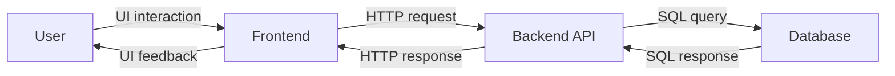
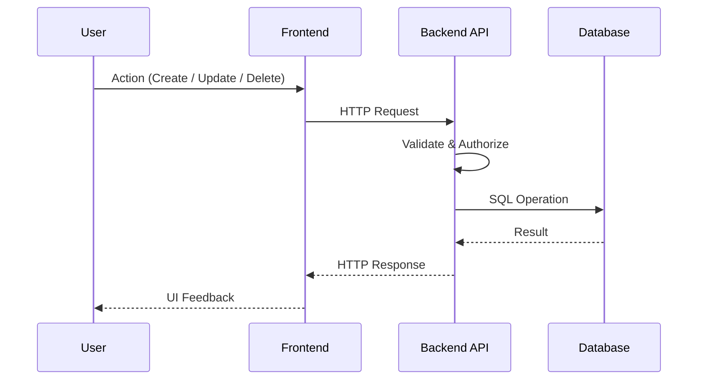
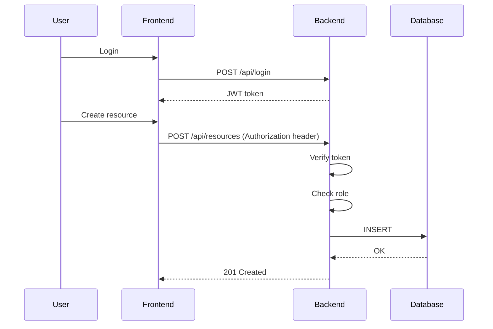

> [!NOTE]
> The material was created with the help of ChatGPT and Copilot.

# 🧱 CRUD and API Design in Web Applications

## 1️⃣ What is CRUD?

CRUD represents the four fundamental operations of persistent data systems:

| Operation  | Meaning              | Database action |
| ---------- | -------------------- | --------------- |
| **Create** | Add new data         | `INSERT`        |
| **Read**   | Retrieve data        | `SELECT`        |
| **Update** | Modify existing data | `UPDATE`        |
| **Delete** | Remove data          | `DELETE`        |

CRUD is not a programming feature → It is a **data lifecycle model**.

Every resource-based web system (like our Booking System) is fundamentally a CRUD system.

---

## 2️⃣ What is an API?

An **Application Programming Interface (API)** defines how systems communicate.

In modern web applications, this usually means:

* A client (browser / frontend)
* A server (backend)
* Communication via HTTP
* Structured data (typically JSON)

Most modern web applications use a **REST-style API**.

---

**Example Resource**

If we manage resources (e.g., rooms, equipment), the resource concept becomes the center of the API:

```
/api/resources
```

---

## 3️⃣ How CRUD Maps to HTTP

CRUD operations map naturally to HTTP methods:

| CRUD       | HTTP Method | Endpoint             | Typical Status Code |
| ---------- | ----------- | -------------------- | ------------------- |
| Create     | POST        | `/api/resources`     | 201 Created         |
| Read (all) | GET         | `/api/resources`     | 200 OK              |
| Read (one) | GET         | `/api/resources/:id` | 200 OK              |
| Update     | PUT / PATCH | `/api/resources/:id` | 200 OK              |
| Delete     | DELETE      | `/api/resources/:id` | 204 No Content      |

This mapping creates a **predictable and scalable API structure**.

---

## 4️⃣ Conceptual Architecture

Here is the high-level interaction model:



The API acts as the **controlled gateway** between user actions and persistent data.

---

## 5️⃣ Example: CREATE Resource

Let’s walk through a real scenario.

---

**Step 1: User Action**

User fills a form and submits.

---

**Step 2: Client-side Validation**

JavaScript checks:

* Required fields
* Format
* Basic constraints

---

**Step 3: HTTP Request**

```http
POST /api/resources
Content-Type: application/json
```

Body:

```json
{
  "name": "Meeting Room A",
  "description": "Room with projector",
  "available": true,
  "price": 10.00
}
```

---

**Step 4: Server-side Validation**

Backend checks:

* Required fields
* Business rules
* Duplicates
* Data types

---

**Step 5: Database Action**

```sql
INSERT INTO resources (...)
```

---

**Step 6: HTTP Response**

* 201 Created (success)
* 400 Bad Request (validation error)
* 409 Conflict (duplicate)
* 500 Internal Server Error (unexpected failure)

---

## 6️⃣ Why CRUD + API Separation Matters

**Frontend:**

* User experience
* Immediate validation
* Rendering

---

**Backend:**

* Security
* Validation
* Business logic
* Data integrity

---

**Database:**

* Persistence
* Constraints
* Transactions

---

**This layered design prevents:**

* Direct database exposure
* Trusting user input
* Business logic duplication

---

## 7️⃣ API Design Principles

A well-designed API should be: 

**✔ Resource-Oriented**

Think in nouns, not verbs:

```
/api/resources
/api/users
/api/reservations
```

Not:

```
/api/createResource
/api/deleteResource
```

---

**✔ Predictable**

HTTP method defines action.

---

**✔ Stateless**

Each request contains everything needed.

---

**✔ Explicit About Errors**

Use correct status codes:

* 400 → Validation problem
* 401 → Not authenticated
* 403 → Not authorized
* 404 → Not found
* 409 → Conflict
* 500 → Server failure

---

## 8️⃣ Linking CRUD to System Quality

CRUD is not just about data → It directly impacts:

---

**🔐 Security**

* Input validation
* SQL injection prevention
* Proper status codes
* Role-based access control

---

**📊 Logging**

Each CRUD action should produce log entries:

* Who did it?
* What changed?
* When?
* Was it successful?

---

**⚖ Data Integrity**

* Unique constraints
* Foreign keys
* Transactions

---

## 9️⃣ Full CRUD Flow Overview



This is the core lifecycle of modern web systems.

---

## 🔟 Key Takeaways

1. CRUD describes **data lifecycle**
2. HTTP methods implement CRUD in APIs
3. API is the secure boundary layer
4. Validation must exist on both client and server
5. Proper status codes are part of system design
6. Clean API structure improves scalability
7. Good CRUD implementation improves security and maintainability

---

# 🏢 API Standards, Testing, and Security

Modern APIs are not just endpoints. They are **contracts**, **security boundaries**, and **integration platforms**.

To build production-grade systems, we must consider:

1️⃣ Standards  
2️⃣ Testing  
3️⃣ Authentication  
4️⃣ Authorization  

---

## 1️⃣ API Standards

**🔹 REST (Representational State Transfer)**

REST is the dominant architectural style for web APIs.

---

Key principles:

* Resource-oriented URLs
* HTTP methods define actions
* Stateless communication
* Structured responses (usually JSON)

---

Example:

```
GET    /api/resources
GET    /api/resources/:id
POST   /api/resources
PUT    /api/resources/:id
DELETE /api/resources/:id
```

REST is not a protocol → It is a **design philosophy**.

---

**🔹 OpenAPI Specification (OAS)**

The most widely adopted API documentation standard: [OpenAPI Specification](https://swagger.io/specification/)

It allows:

* Machine-readable API documentation
* Automatic client generation
* Validation of request/response schemas
* Interactive documentation

Often visualized with: [Swagger UI](https://swagger.io/tools/swagger-ui/)

Example snippet:

```yaml
paths:
  /api/resources:
    post:
      summary: Create a new resource
      responses:
        '201':
          description: Created
        '400':
          description: Validation error
```

This makes the API a **formal contract**.

---

**🔹 HTTP Standards**

Defined by: [IETF → http ver 2.0](https://datatracker.ietf.org/doc/html/rfc7540)

Important aspects:

* Status codes
* Headers
* Content types
* Authentication mechanisms

Correct usage of HTTP is part of API quality.

---

## 2️⃣ API Testing

API testing ensures:

* Correct functionality
* Correct status codes
* Correct validation behavior
* Security enforcement

---

### 🔹 Manual Testing

**Using curl**

```bash
curl -X POST http://localhost:3000/api/resources \
  -H "Content-Type: application/json" \
  -d '{"name":"Room A"}'
```

Good for:

* Backend debugging
* CI pipeline smoke tests

---

**Using [Postman](https://www.postman.com/)**

Allows:

* Saved requests
* Environment variables
* Automated test scripts
* Team collaboration

---

**🔹 Automated Testing**

In Node.js, typically:

* [Supertest](https://www.npmjs.com/package/supertest)
* [Jest](https://jestjs.io/)
* [Vitest](https://vitest.dev/)

Example test idea:

* POST valid → expect 201
* POST invalid → expect 400
* POST duplicate → expect 409
* DELETE missing → expect 404

Testing is verifying the **API contract**.

---

**🔹 Contract Testing**

Ensures:

* Frontend and backend agree
* Response structure stays stable
* No silent breaking changes

This becomes critical in larger systems.

---

## 3️⃣ Security in APIs

APIs are high-value attack surfaces.

Main categories:

* Input attacks
* Authentication bypass
* Authorization failures
* Injection attacks
* Data exposure

---

## 4️⃣ Authentication (Who Are You?)

Authentication verifies identity. Common methods:

---

### 🔹 Session-Based Authentication

* User logs in
* Server creates session
* Session ID stored in cookie

Good for:

* Traditional web apps

---

### 🔹 Token-Based Authentication ([JSON Web Token](https://www.jwt.io/))

Flow:

1. User logs in
2. Server generates signed token
3. Client sends token in header:

```
Authorization: Bearer <token>
```

Advantages:

* Stateless
* Scalable
* API-friendly

---

### 🔹 [OAuth 2.0](https://oauth.net/2/)

Used for:

* Third-party login
* Delegated authorization
* Enterprise systems

---

## 5️⃣ Authorization (What Are You Allowed To Do?)

Authentication ≠ Authorization

Example:

| Role  | Can Create | Can Delete | Can View |
| ----- | ---------- | ---------- | -------- |
| Guest | ❌          | ❌          | ✅        |
| User  | ✅          | ❌          | ✅        |
| Admin | ✅          | ✅          | ✅        |

Authorization should be enforced:

* On backend
* Before database action
* Based on role / policy

---

### Role-Based Access Control (RBAC)

Example middleware logic:

```
if (user.role !== "admin") {
   return 403 Forbidden
}
```

This must never rely on frontend checks.

---

## 6️⃣ Secure API Flow



Security is layered:

* Authentication
* Authorization
* Validation
* Database constraints

---

## 7️⃣ Security Best Practices for APIs

✔ Always validate input (server-side)  
✔ Use parameterized SQL queries  
✔ Return minimal error information  
✔ Use HTTPS  
✔ Use proper status codes  
✔ Log security-relevant events  
✔ Never trust frontend data  

---

## 8️⃣ Typical API Vulnerabilities

Common issues include:

* Broken access control
* Insecure direct object reference
* Injection
* Excessive data exposure
* Missing rate limiting

These are highlighted in: [OWASP API Security Top 10](https://owasp.org/www-project-api-security/).

---

## 9️⃣ Bringing It All Together

Professional API design requires:

| Layer          | Responsibility             |
| -------------- | -------------------------- |
| HTTP           | Standardized communication |
| REST           | Structured resource model  |
| OpenAPI        | Contract documentation     |
| Testing        | Reliability                |
| Authentication | Identity verification      |
| Authorization  | Access control             |
| Validation     | Data integrity             |
| Logging        | Accountability             |

A CRUD endpoint without:

* Testing
* Authentication
* Authorization
* Standards compliance

**is not production-ready.**

---
