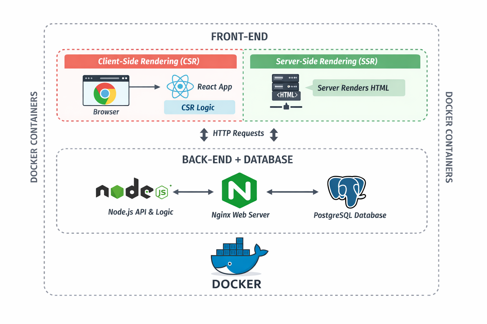

# 🚀 Advanced Web Development – Hands-on Scenario

In this scenario, the focus is on **building a functional, real web application** rather than isolated code examples.

At the beginning of the course, we will

> **🏗️ implement a complete web-based booking system together**.

This system will be **fully operational** and demonstrates how modern web applications are built in practice — from user interface to server logic and data storage.

After completing the shared implementation, you will apply the same concepts and techniques to **develop your own web application**, following similar architectural principles but with your own design and features.

---

## 🎯 Learning Focus

The scenario is built around **practical full-stack web development**, with a strong emphasis on how different parts of a web application work together:

* **🖥️ Front-end development**

  * User interfaces
  * Client-side logic
  * Browser-based interaction

* **⚙️ Back-end development**

  * Server-side logic
  * Authentication and authorization
  * Data handling and persistence

The goal is to understand **how front-end and back-end form a single, working system**.

---

## 🧩 System Overview

The example system is a **web-based resource booking system** with the following characteristics:

* The system is accessed through a **🌐 web browser** 
* Users can **🔐 register and log in** 
* A logged-in user has one of two roles:

  * **📅 Resource reserver**
  * **🛠️ Administrator**

---

### 👥 Roles and Core Functionality

**🛠️ Administrators** manage the system and can:

* Add, remove, and modify **resources**
* Add, remove, and modify **reservations**
* Delete existing **reserver accounts**

**📅 Reservers** can:

* Book available resources if they are **over 15 years old**
* Make bookings on an **hourly basis**

---

### 🔍 Visibility, Privacy, and System Behavior

* Booked resources are **👀 visible without logging in** 
* The **🔒 identity of the reserver is never shown publicly** 
* Role-based access control is enforced throughout the system

These requirements reflect **real-world constraints** and influence both front-end behavior and back-end logic.

---

### ✅ Scenario Outcome

By the end of the scenario, you will be able to:

* Build a **🧱 working full-stack web application** 
* Implement and connect front-end and back-end components
* Design systems that enforce roles and permissions
* Move from a guided example to an **🚀 independently developed application** 

This scenario emphasizes **🎓 working software, clear structure, and practical understanding**.

---

## 🧰 Technologies and Development Environment

This scenario is implemented using a **modern, industry-relevant web development stack**. Everyone is expected to **set up, run, and develop the system locally** using the technologies listed below.

The ability to **work in this environment independently** is a core learning objective of the scenario.

---

### 🎨 Front-end Technologies

* **Tailwind CSS**

  * Utility-first CSS framework for building responsive and maintainable user interfaces
* **JavaScript**

  * Core language for client-side logic and interaction
* **React**

  * Used for building dynamic user interfaces
  * Supports both **Client-Side Rendering (CSR)** and **Server-Side Rendering (SSR)** approaches

---

### ⚙️ Back-end and Infrastructure

* **Node.js**

  * Server-side runtime for application logic and APIs
* **PostgreSQL**

  * Relational database for persistent data storage
* **Nginx**

  * Used as a web server and reverse proxy
* **Docker**

  * All services are containerized
  * Ensures consistent development and runtime environments across different operating systems

The system consists of **multiple cooperating services**, reflecting real-world production setups.

---

### 🔁 Rendering Approaches: CSR and SSR

Throughout the scenario, we explicitly compare and apply:

* **Client-Side Rendering (CSR)**

  * Rendering logic handled primarily in the browser
* **Server-Side Rendering (SSR)**

  * Rendering performed on the server before content is sent to the client

Understanding the **trade-offs, use cases, and implementation differences** between CSR and SSR is an essential part of the scenario.

> **Check architecture diagram below**

---

### 🧑‍💻 Development Tools

* **Visual Studio Code**

  * Primary development environment
* **GitHub**

  * Version control
  * Submission and review of task

---

### ✅ Environment Requirement

Everyone must be able to:

* Build the application environment locally
* Run the system using Docker
* Develop front-end and back-end features
* Debug issues across the full stack
* Understand how all components work together

The focus is not only on writing code, but on **operating and understanding a complete web application environment**.

Alla on **selkeä, opiskelijaa rohkaiseva osio**, joka istuu luontevasti aiempaan tekstiin ja tasapainottaa teknistä vaativuutta. Sävynä on **ammatillinen mutta inhimillinen** – tärkeä erityisesti toisen vuoden opiskelijoille.

Voit lisätä tämän esimerkiksi **Environment Requirement -osion jälkeen**.

---

## 🤝 Learning Together → You Are Not Alone

This scenario is **technically demanding**, and that is intentional.

> However, **no one is expected to solve everything alone**.

Collaboration, asking questions, and seeking help are **part of professional software development**.

---

### 👥 Ask and Discuss

You are strongly encouraged to:

* Ask questions from **your fellow students**
* Discuss problems and solutions together
* Share experiences about setup issues, bugs, and development challenges

Learning how to **communicate technical problems** is an essential skill.

---

### 👨‍🏫 Ask the Teacher

If something does not work or feels unclear:

* Ask the teacher
* Bring concrete questions, error messages, or screenshots
* No question is considered “too basic” in this scenario

---

### 🧑‍💻 Come to the Workshop

If your development environment does not work as expected:

👉 **Come to the workshop.**

We will:

* Set up the environment **together**
* Debug issues step by step
* Make sure everyone can run the system locally

The workshop is a **safe place to fail, ask, and fix things**.

---

### 🎯 Why This Matters

Modern web development is a **team activity**. Knowing **when and how to ask for help** is just as important as writing code.

Success in this scenario is built on:

* Technical skills
* Collaboration
* Active participation

You are not alone → and you are expected to learn **together**.

---
