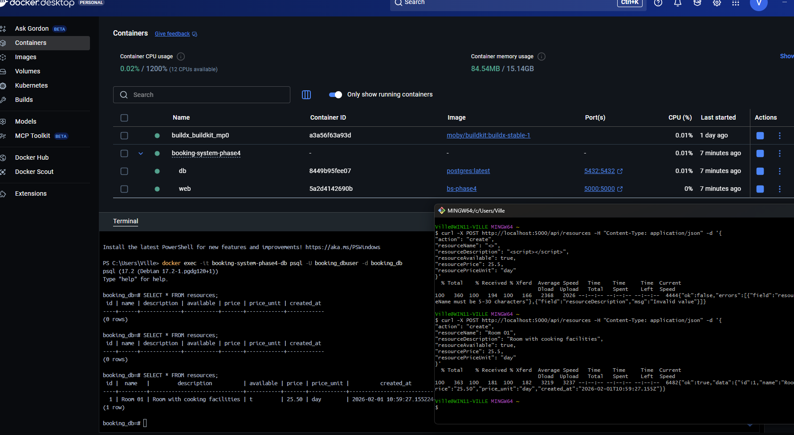

> [!NOTE]
> The material was created with the help of ChatGPT and Copilot.

# 📘 Task E1: Fixing Server-Side Validation **and Functionality**

## 🎯 Goal

The goal of this task is to **identify and fix problems in server-side validation *and* server-side functionality** in a **full-stack Booking System**.

The backend currently:

* accepts invalid input
* processes requests incorrectly
* stores **wrong values in the database due to flawed server logic**

Your task is to **fix both validation and functionality** so that:

* only meaningful data is accepted
* correct values are written to the database
* the system behaves consistently end-to-end

---

## 🧠 Background Concepts

### 📦 Full-Stack Project (Important)

The provided ZIP file contains a **complete full-stack application**, including:

* frontend (HTML, CSS, JavaScript)
* backend (Node.js)
* database setup
* database connection logic

This means:

* the system is **not partially mocked**
* everything required to run the Booking System is included
* the application must be **fully deployed** before debugging can begin

---

### 🚀 Deployment Comes First

Before fixing any code, you must **set up the system correctly**.

You must:

* deploy the application using **either**

  * a **Virtual Machine**, or
  * **Docker**
* follow the **deployment video provided in Itslearning**

⚠️ During deployment:

* the **database is enabled**
* the **database connection is activated**
* this differs from previous tasks where a database was **not** in use or not required

If the deployment is incorrect, debugging the server logic is impossible.

---

### 🔁 CRUD in a Nutshell

Most backend systems are built around **CRUD operations**:

* **C** – Create
* **R** – Read
* **U** – Update
* **D** – Delete

In this task:

* only the **Create (C)** operation is implemented
* it is implemented in a **minimal and intentionally flawed way**
* both **validation and functional logic are incomplete**

Your responsibility is to **fix the Create operation**, not redesign the entire system.

---

## 📦 Provided Materials

* A **ZIP file** containing the **entire Booking System**
  👉 https://github.com/vheikkiniemi/AdvWebDev2026K/blob/main/Materials/Phase4/BookingSystemPhase4.zip
* The ZIP includes:

  * frontend code
  * Node.js backend
  * database configuration
  * database connection logic

⚠️ The main file you must modify is:

```
index.js
```

---

## 🛠️ What You Must Do

### 1️⃣ Deploy the system (mandatory)

* Extract the ZIP file
* Deploy the system using:

  * a **Virtual Machine** **or**
  * **Docker**
* Follow the **Itslearning deployment video exactly**

During this phase:

* the database must be running
* the backend must successfully connect to the database

This setup **differs from earlier tasks**, where no active database connection was required.

---

### 2️⃣ Observe the broken behavior

Once deployed:

* submit invalid or illogical data
* observe that:

  * the server accepts it
  * incorrect values are written to the database

This confirms that:

* validation is missing
* functional logic is flawed

---

### 3️⃣ Debug the backend using tools (mandatory)

You must debug the backend **without relying only on the browser**.

Use one or more of the following:

* `curl`
* Postman
* VS Code REST Client
* similar HTTP tools

Your goal is to:

* send malformed or logically incorrect requests
* analyze server responses
* identify **where server-side logic fails**

💡 Example idea (not a solution):

```bash
curl -X POST http://localhost:5000/resource \
  -H "Content-Type: application/json" \
  -d '{"action":""}'
```

---

### 4️⃣ Fix validation **and** functionality in `index.js`

Modify the server so that:

#### ✔ Validation

* required fields are enforced
* empty or malformed input is rejected
* meaningful HTTP error responses are returned

#### ✔ Functionality

* request data is processed correctly
* values stored in the database match the intended logic
* incorrect code paths are removed or corrected

🚫 Client-side fixes alone are **not sufficient**.

---

### 5️⃣ Verify correct behavior

After your fixes:

* invalid requests are rejected
* valid requests behave correctly
* the database contains only correct and meaningful data

Re-test using the same tools (`curl`, Postman, etc.).

---

### 6️⃣ Redeploy and demonstrate the working system 🚀

Run the **fixed version** in:

* a **Virtual Machine** **or**
* a **Docker container**

Then take **one screenshot** that clearly shows:

* visible proof of the running backend environment (VM or Docker)
* a terminal showing **two `curl` commands and their outputs**:

  1. ✅ **A request that is blocked by server-side validation** (the server returns an error)
  2. ✅ **A valid request that succeeds and is stored in the database**

📌 The screenshot must prove that **backend is running**, and that you can demonstrate **both outcomes** (blocked + stored) using `curl`. Below is an example of a screenshot.




💡 Commands used in the screenshot

```bash
curl -X POST http://localhost:5000/api/resources -H "Content-Type: application/json" -d '{
"action": "create",
"resourceName": "<>",
"resourceDescription": "<script></script>",
"resourceAvailable": true,
"resourcePrice": 25.5,
"resourcePriceUnit": "day"
}'
```
---

```bash
curl -X POST http://localhost:5000/api/resources -H "Content-Type: application/json" -d '{
"action": "create",
"resourceName": "Room 01",
"resourceDescription": "Room with cooking facilities",
"resourceAvailable": true,
"resourcePrice": 25.5,
"resourcePriceUnit": "day"
}'
```

---

### 7️⃣ Push the fixed code to GitHub 📂

* Use the **same GitHub repository** as in previous tasks
* Repository structure must include:

```
BookingSystem/
└── Phase4/
    └── (all working frontend + backend files)
```

* Push **only the corrected, working version**

---

## 📤 Submission Instructions (Itslearning)

Submit:

1. 📸 **One screenshot**

   * shows the deployed system running
   * includes:

     * VM or Docker proof
     * a debugging tool (e.g. `curl` or Postman) with output
2. 🔗 **GitHub link**

   * pointing to `BookingSystem/Phase4`

---

## 🧪 Grading Criteria (0–2 points)

* **`0 points:`** Screenshot missing/unclear **and/or** code missing from GitHub
* **`1 point:`** At least **3 of the 6 errors fixed** (client-side and/or server-side)
* **`2 points:`** **All 6 errors fixed**, system works end-to-end, clear screenshot 

---

## 💬 Notes

* Client-side validation improves usability.
* Server-side validation **and correct logic** protect data integrity.

> This task reflects real-world backend work: **first deploy, then debug, then fix — with a live database in place.**