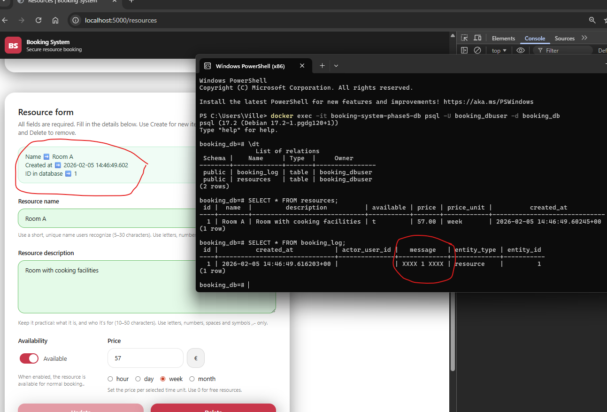
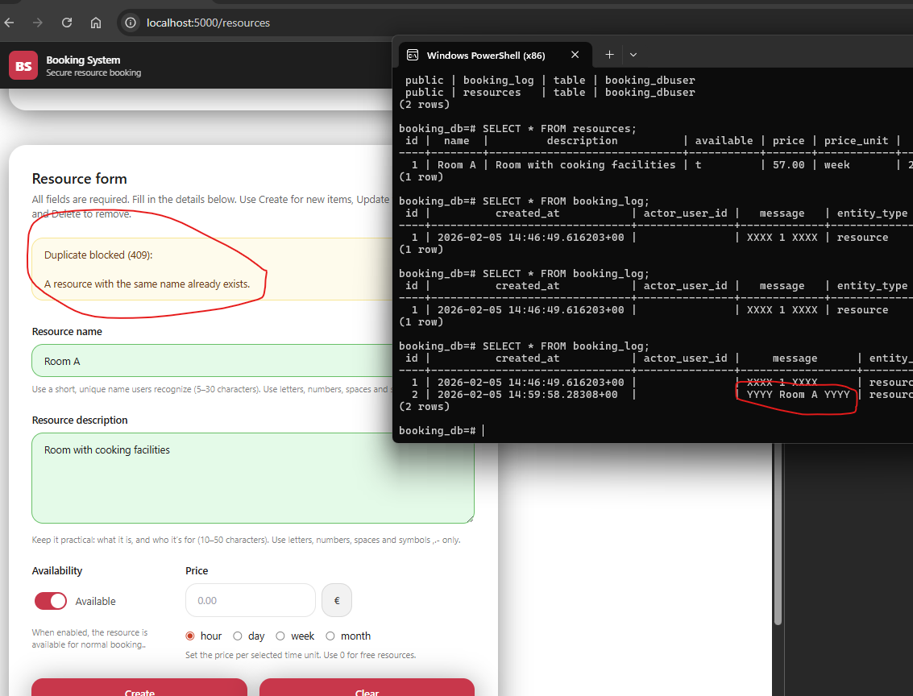

> [!NOTE]
> The material was created with the help of ChatGPT and Copilot.

# 📘 Task F1: Clear Logging + Clear User Messages

> [!NOTE]
> This task continues the same Booking System workflow style as earlier tasks (deploy → test → fix → prove with screenshots). 

## 🎯 Goal

In this task you will improve **two kinds of messages** in the Booking System:

1. **Backend log entries** written into a **database table for logs**
2. **Frontend user-facing messages** shown after trying to add a resource

Right now the system writes **unclear** log messages when:

* a resource is created successfully



* creation fails due to a **duplicate**



* creation fails due to a validation


And the UI messages shown to the user are also unclear for (see screenshots above):

* success
* duplicate
* validation error

Your job is to make messages **descriptive, consistent, and useful** ✅

---

## 🧠 Background (why this matters)

Good messages help different roles:

* 👩‍💻 **Developer:** can debug faster
* 🛠️ **Admin / Maintainer:** can understand what happened without reading code
* 🙋 **End user:** gets clear feedback (what happened + what to do next)

This task focuses on **communication quality** in a real full-stack system.

---

## 📦 Provided Materials

* A **ZIP file** containing the **entire Booking System**
  👉 https://github.com/vheikkiniemi/AdvWebDev2026K/blob/main/Materials/Phase5/BookingSystemPhase5.zip
* The ZIP includes:

  * frontend code
  * Node.js backend
  * database configuration
  * database connection logic

---

## 🚀 Deployment Comes First

Before fixing any code, you must **set up the system correctly**.

You must:

* deploy the application using **either**

  * a **Virtual Machine**, or
  * **Docker**
* follow the **deployment video provided in Itslearning**

---

# ✅ Part 1 — Improve backend log messages (database logs table)

## What you must do

### 1️⃣ Find the correct backend file

Your mission is to locate the code that inserts rows into the **logs table**.

How to find it quickly:

* Search the backend for keywords like:

  * `INSERT INTO logs`
  * `logs`
  * `log_message`
  * `logger`
  * `duplicate`
  * `409`
  * `resource created`

💡 Tip: the log insert usually happens near the resource “create” endpoint, or inside a helper function/service.

---

### 2️⃣ Rewrite unclear log messages into descriptive log messages

Update the messages so that they clearly describe **what happened**.

✅ Your new log messages must be:

* specific (understandable without extra context)
* consistent (same style each time)
* related to the result (success vs duplicate)

Example ideas (you can write your own):

* ✅ `RESOURCE_CREATED: name="Room 01", price=25.50, unit="day"`
* ⛔ `RESOURCE_CREATE_BLOCKED_DUPLICATE: name="Room 01" (409)`

*(Use your own wording, but it must be clearly descriptive.)*

---

### 3️⃣ Test and prove it with a database screenshot

1. Test from the browser:

   * add a new resource (success)
   * add the same resource again (duplicate)
2. Open the database logs table and take **one screenshot** that clearly shows:

   * the new descriptive messages
   * at least one “success” and one “duplicate” log entry visible

📸 The screenshot must show the **messages clearly**.

---

# ✅ Part 2 — Improve user-facing messages (frontend)

## What you must do

### 1️⃣ Find where UI messages are shown

Locate the frontend code that displays success/error messages when adding a resource.

Common places:

* `form.js`
* `resources.js`
* a UI helper like `showMessage()`, `toast()`, `showFormMessage()`, etc.

---

### 2️⃣ Fix messages for these 3 outcomes

Update user-visible messages so they are clear and helpful:

✅ **A) Resource added successfully**

* Should confirm success
* Should be friendly and specific enough

✅ **B) Duplicate blocked**

* Must clearly explain that the resource already exists
* Should suggest what to do (change name / check list)

✅ **C) Validation error**

* Must clearly tell the user that input was invalid
* Should encourage fixing the fields and trying again

⚠️ **Important note for this task **

* For testing purposes, **frontend guarantees are intentionally not fully aligned with backend rules**.
* So you must rely on **real server responses** and handle errors properly.

---

### 3️⃣ Test and prove it with screenshots

Test again in the browser and take screenshots that show the new messages:

📸 Required screenshots (you can also combine):

* one screenshot showing **success** message
* one screenshot showing **duplicate** message
* one screenshot showing **validation error** message

(Three screenshots total for Part 2.)

---

### 4️⃣ Push the fixed code to GitHub 📂

* Use the **same GitHub repository** as in previous tasks
* Repository structure must include:

```
BookingSystem/
└── Phase4/
    └── (all working frontend + backend files)
```

* Push **only the corrected, working version**

---

## 📤 Submission Instructions (Itslearning)

Submit:

1. 📸 **Screenshots**

* **Part 1:** 1 database screenshot (logs table with descriptive messages)
* **Part 2:** 3 UI screenshots (success + duplicate + validation error)

2. 🔗 **GitHub link**

   * pointing to `BookingSystem/Phase5`

---

## 🧪 Grading Criteria (0–2 points)

* **`0 points:`** No valid proof (screenshots missing/unclear) and/or code not pushed
* **`1 point:`** Only **one part** completed (Part 1 *or* Part 2)
* **`2 points:`** **Both parts** completed with clear screenshots + code in GitHub

---

## ✅ Checklist

* [ ] Found backend logging code and rewrote log messages
* [ ] Verified logs table contains descriptive entries (screenshot)
* [ ] Updated frontend success/duplicate/validation messages
* [ ] Took 3 UI screenshots (or combine) 👉 (success + duplicate + validation error)
* [ ] Pushed changes to GitHub and submitted link
